# 🥗 NutriTrack

NutriTrack is an AI-powered, user-friendly health tracking web application designed to help people achieve their wellness goals through **personalized diet plans**, **custom workouts**, and **holistic lifestyle guidance**.
With just your *height* and *weight*, NutriTrack calculates your BMI, offers guidance, and uses AI to create tailored plans—making it your **personal trainer, nutritionist, and health coach** all in one.
---
**Live App:** [nutritrack-5qbw.onrender.com](https://nutritrack-5qbw.onrender.com)

## 📖 Overview
NutriTrack focuses on **simplicity and personalization**. Whether you want to lose weight, gain muscle, improve stamina, or maintain a healthy lifestyle, the app will guide you through:
- AI-generated **meal and workout** recommendations.
- **Progress tracking** and **streak motivation**.
- **Holistic health advice** including sleep, hydration, and supplements.
The platform combines **science-backed recommendations** with **interactive UI modules** so that fitness becomes intuitive and engaging.
---
## 🚀 Features
- 🔐 **User Sign In / Sign Up** – Secure account creation for personalized insights.  
- 📏 **Quick Start** – Enter two values: height & weight.  
- 📊 **Smart BMI Calculation** – Automatic BMI computation with actionable tips.  
- 🥗🏋 **Personalized Diet & Exercise Plans** – Maintain your fitness effectively.  
- 🤖 **AI Meal & Workout Generator** – Dynamic, goal-based plans.  
- 💬 **Health AI Chatbot** – Instant answers to fitness & nutrition questions.  
- 🔥 **Streak Tracking & Motivation** – Smart reminders to help maintain consistency.  
- 🧘 **Wellness Modules** – Yoga sessions, lifestyle tips, and holistic improvement.
---
## 🧩 Modules
1. **Nutritional Goals & Supplements** – Balanced intake guidance, supplement suggestions.  
2. **Lifestyle Tips** – Sleep, hydration, sugar & activity advice.  
3. **AI Workout Plans** – Multi-day personalized training routines.  
4. **Basic Workout Module** – Illustrated easy-to-follow exercises.  
5. **Weekly Exercise Tracker** – Mark completed sessions, muscle group–specific, including Yoga.
4. **Message Sending** - Sending messages to user regarding the app and notifying about the next task to do
---
## 🛠️ Tech Stack
- **Frontend:** React.js, HTML, CSS, JS
- **Backend:** Node.js
- **Database:** MySQL (Railway & Localhost)
- **AI:** Gemini
- **Hosting:** Render

## 📷 Usage

Below are the screenshots representing different parts of the app : 

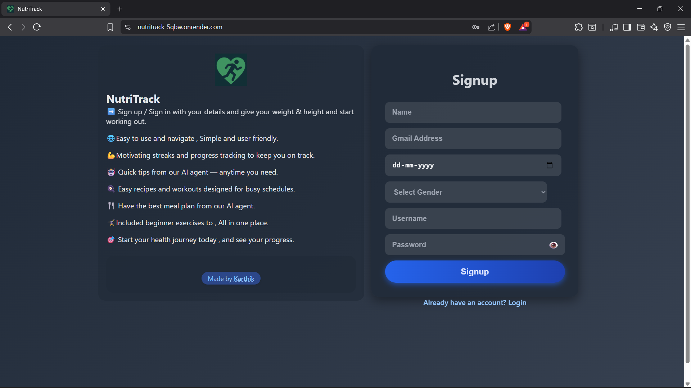  
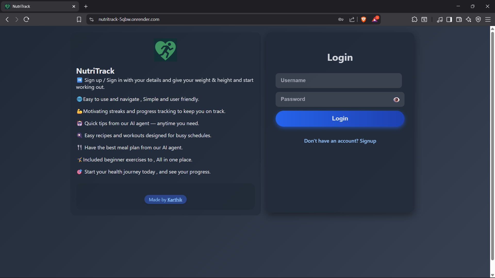 
 
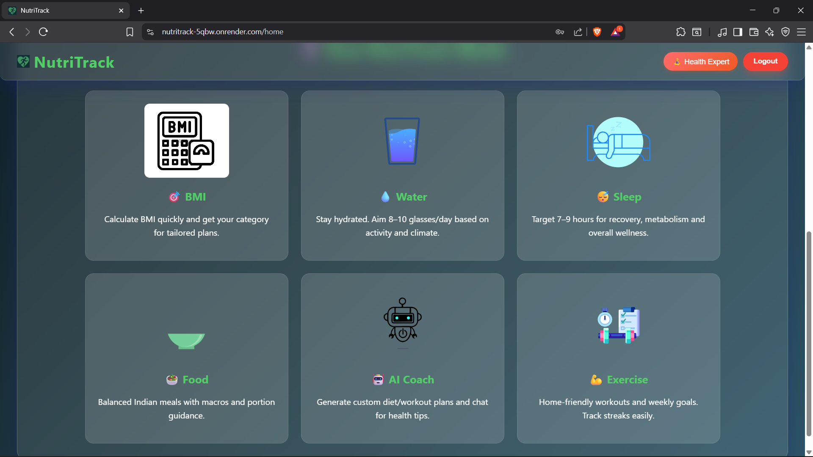 
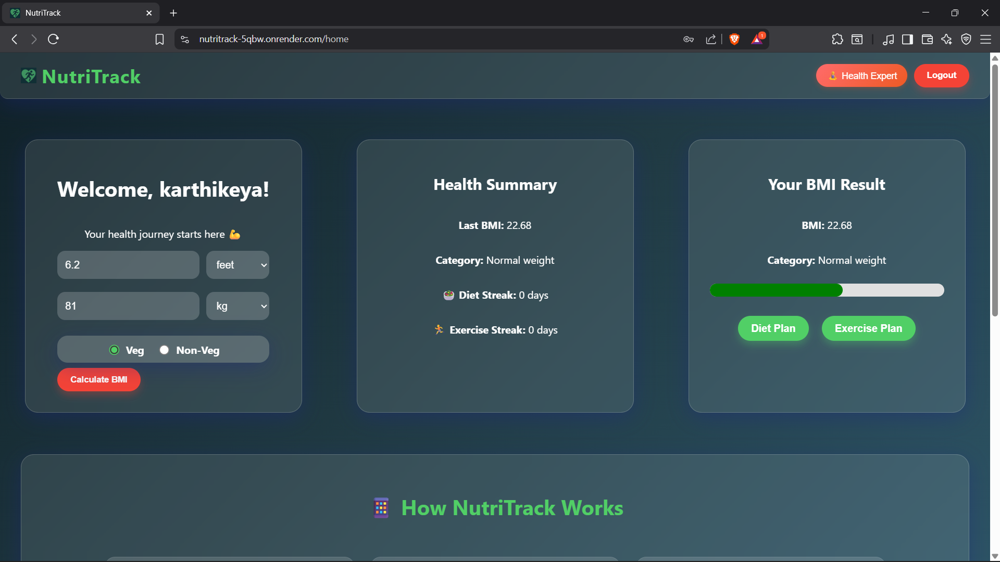 
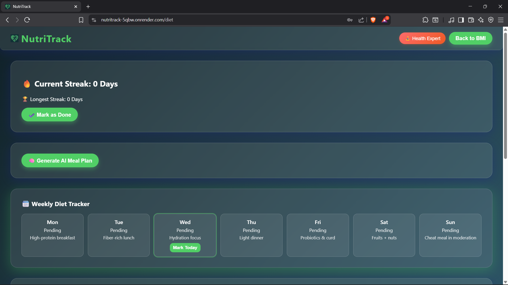 
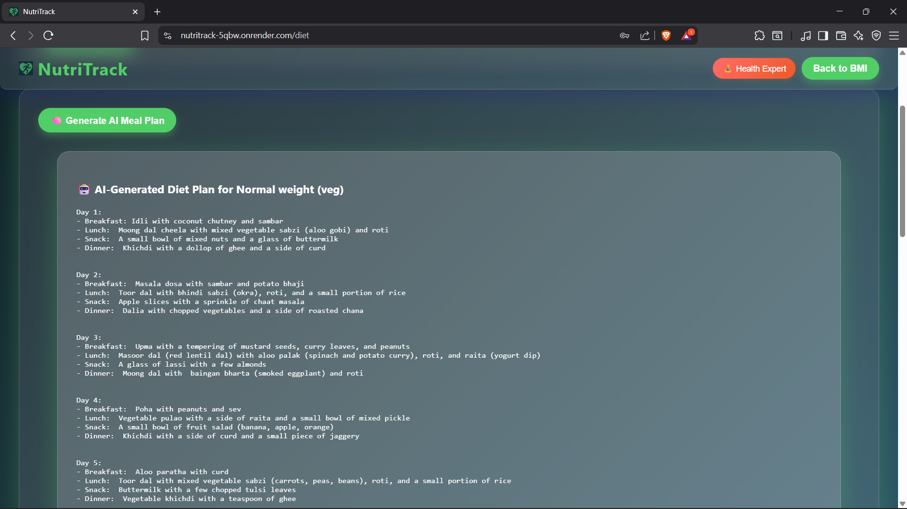 
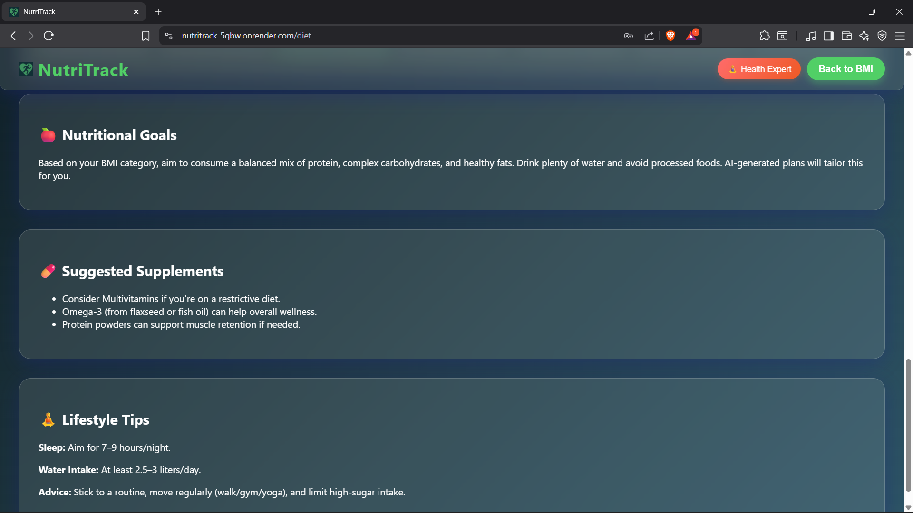 
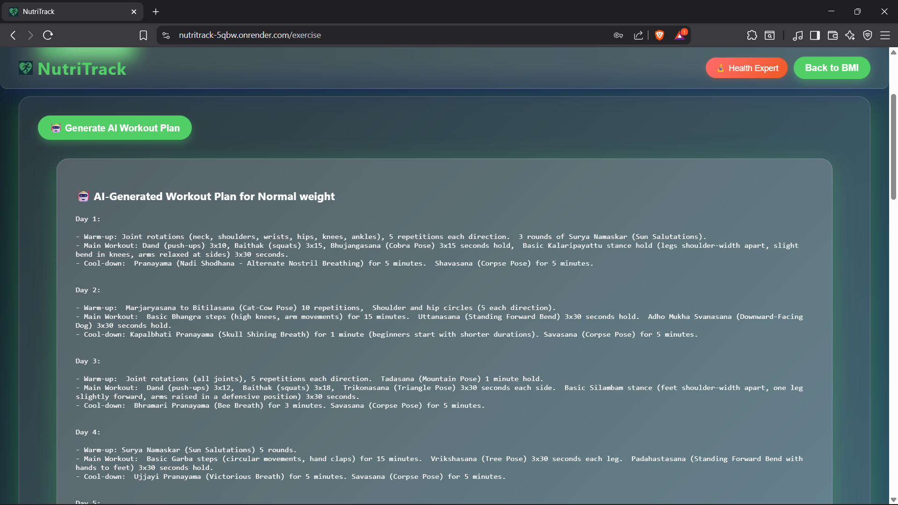 
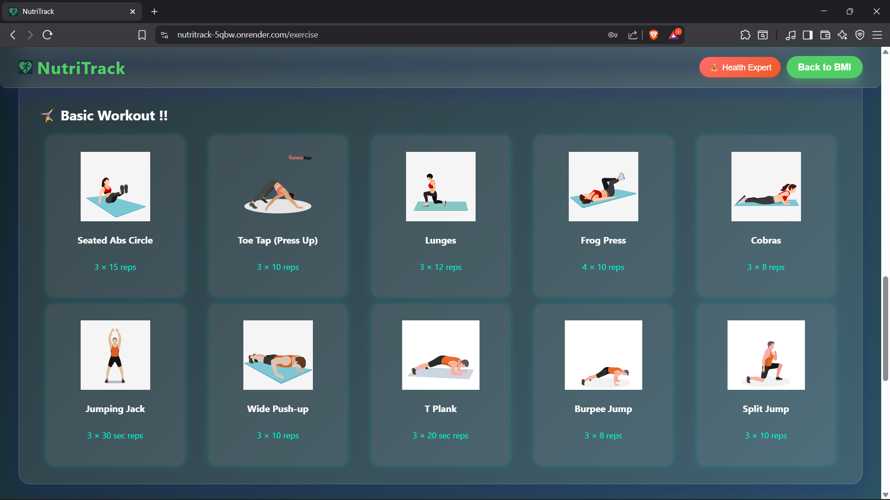 
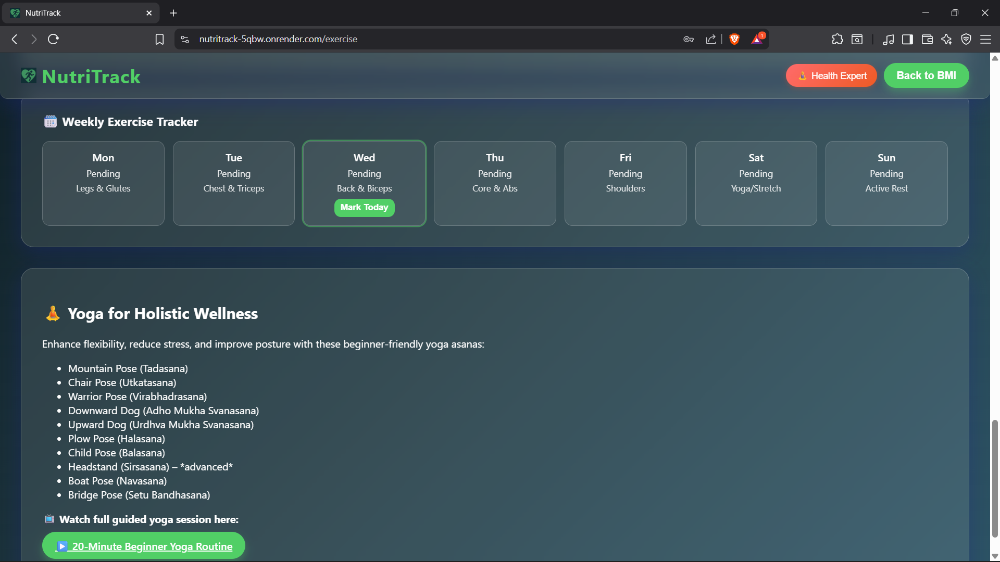 
 
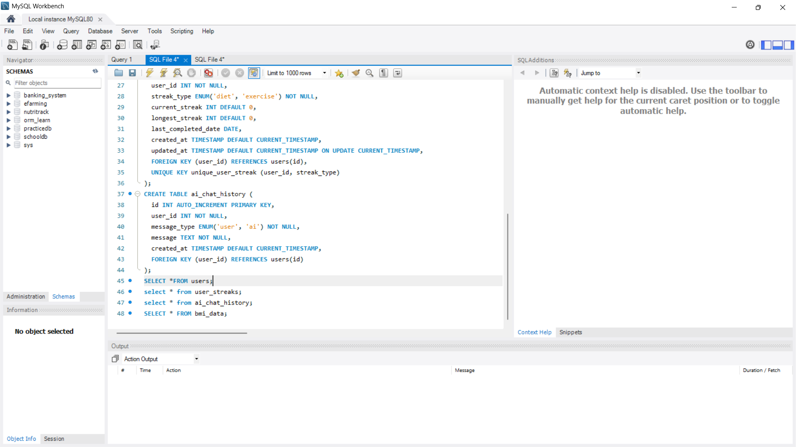 
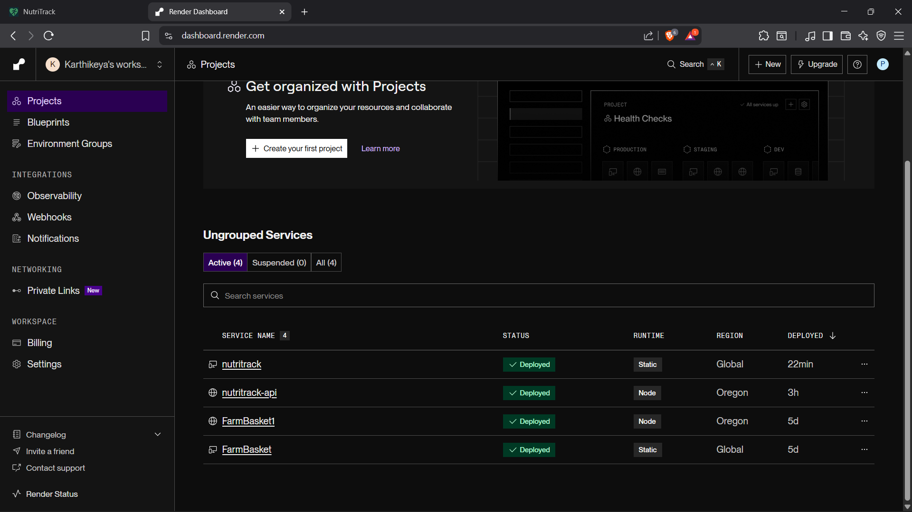 
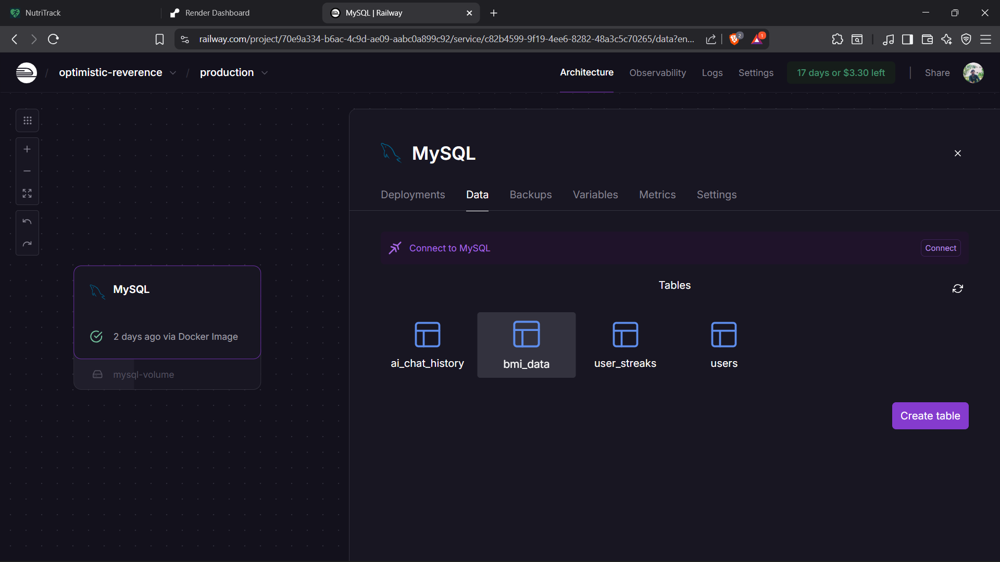 
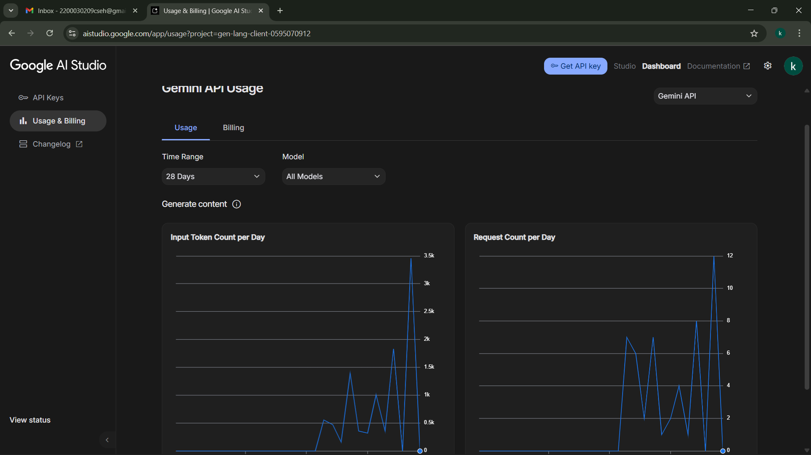 
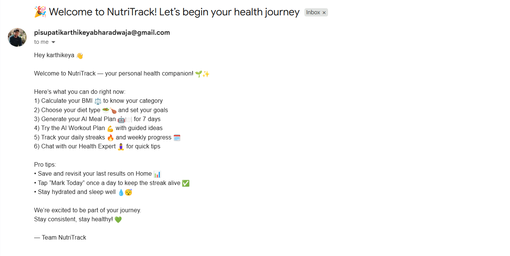 

---

## 💎 Highlights

- Minimal, quick onboarding.  
- AI-powered health plan generation.  
- Included streaks and sending messages to users too 
- Variety of wellness approaches: workouts, yoga, nutrition.  
- Clean, user-friendly design.

---
